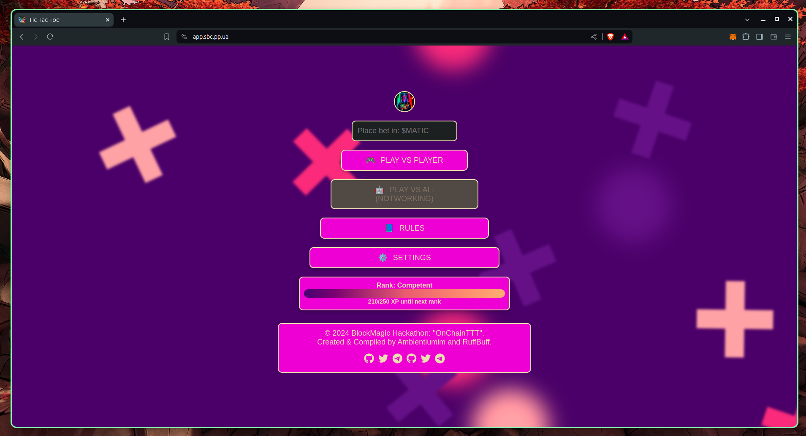
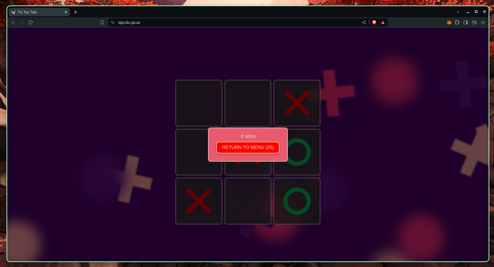

# Block Magic: A Chainlink Hackathon, "OnChainTTT"
Project created & compiled by: [Ambientiumim](https://github.com/Ambientiumim) and [ruffbuff](https://github.com/ruffbuff)

## Supported by
- [NodeJs](https://nodejs.org/)
- [Web3Js](https://web3js.readthedocs.io/en/v1.10.0/)
- [Hardhat](https://hardhat.org/)
- [OpenZeppelin](https://www.openzeppelin.com/)
- [Chainlink Hackathon: Block Magic](https://chain.link/hackathon)

## Demo

## Overview
"Block Magic: OnChainTTT" is a decentralized Tic Tac Toe game innovated for the Chainlink Hackathon. This game leverages blockchain's immutable nature to guarantee both transparency and integrity in gameplay, while integrating Chainlink's oracles for secure random number generation and autonomous enforcement of game states.

## Smart Contract Overview

The `OnChainTTT` is a blockchain-based Tic Tac Toe game that uses smart contract technology to manage the game rules, player interactions, and game outcomes securely and transparently. Below are the simplified descriptions of the contract's main functionalities:

### Key Functionalities

- **Creating and Joining Games**: Players can initiate new games by staking MATIC, the native cryptocurrency on the Polygon network. A second player can join by matching the stake, starting the game.
- **Secure Randomness**: The game leverages Chainlink's Verifiable Random Function (VRF) to securely generate random numbers, which are crucial for fair gameplay, such as deciding who gets the first move.
- **Automated Game Management**: Chainlink Automation is used to check the game's progress and apply the rules automatically. This automation ensures that the game moves forward smoothly without manual intervention and helps resolve games if players become inactive.
- **Deciding Outcomes**: At the end of each game, the smart contract automatically calculates the winner based on the game's rules and distributes the staked MATIC to the winner or returns the stakes in the event of a draw.

### Events for Transparency
The contract emits various events to make the game's progress transparent and verifiable:
- **Game Creation and Participation**: Events such as `GameCreated` and `GameJoined` are logged when games are created or joined.
- **Game Conclusion**: Events like `GameEnded` and `GameCancelled` provide public records of the game outcomes and cancellations.

### Gameplay Functions
- **`createGame()`**: Launches a new game session where others can join.
- **`joinGame(gameId)`**: Lets a second player join a specific game using the game's unique ID.
- **`endGame(gameId)`**: Concludes the game when the conditions are met, like one player winning or a draw.
- **`cancelGame(gameId)`**: Allows the game initiator to cancel the game if no one has bjoined, refunding the stake.

### Randomness and Game Logic
- **`requestRandomWords(gameId, enableNativePayment)`**: Requests random numbers needed for game logic, like deciding the starting player.
- **`fulfillRandomWords(requestId, randomWords)`**: Receives and processes the random numbers from Chainlink VRF to continue the game based on unbiased randomness.

This breakdown clarifies the smart contract's role in facilitating a decentralized and fair gaming experience by automating interactions and utilizing blockchain's inherent security and transparency features.

## Gameplay
Players interact with the `OnChainTTT` smart contract to initiate and play games of Tic Tac Toe. The game logic is enforced on-chain, ensuring that neither player can cheat. Players take turns making moves, with their turns and game outcomes recorded on the blockchain.

## Security and Fairness
By using Chainlink's decentralized services like VRF and Automation, "OnChainTTT" ensures that all random elements are fair and that game state transitions are executed automatically and impartially.

## Conclusion
"Block Magic: OnChainTTT" demonstrates the potential of integrating blockchain technology with traditional games, enhancing them with the benefits of transparency, security, and fairness provided by smart contracts and decentralized computation.

## Visual Overview
Here's a look at the "OnChainTTT" game interface:

## Conclusion
"Block Magic: OnChainTTT" exemplifies the integration of blockchain technology with traditional gaming, enhancing transparency, security, and fairness through the use of smart contracts and decentralized services like Chainlink VRF and Automation. It showcases how blockchain can transform gaming by adding verifiable fairness and automated game management, promising a robust platform for secure, trustless gaming experiences.

Thank you for exploring "Block Magic: OnChainTTT". Dive into the code, try out the game, and see how blockchain technology is revolutionizing the way we play and interact with digital systems.

## License
This project is licensed under the MIT License - see the [MIT LICENSE](LICENSE) file for details.